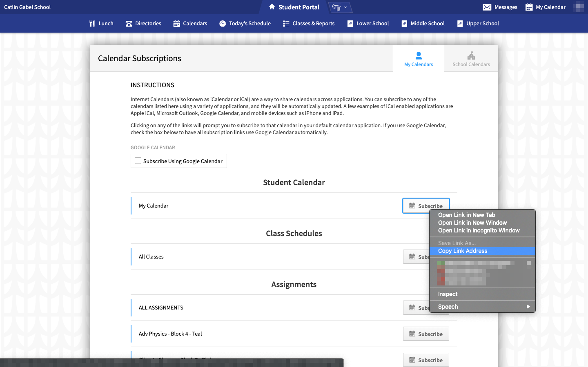
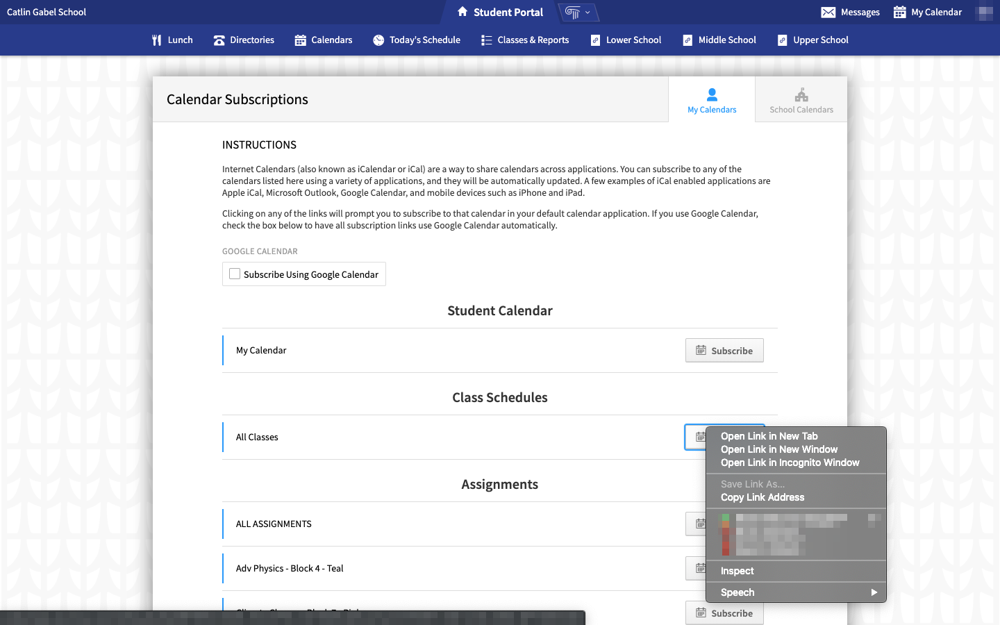

# Catlin Schedule
## Usage
1. Visit this [page](https://portals.veracross.com/catlin/student/calendar/subscribe/mine).
	1. Sign-in if prompted.
2. Copy link address of the *Student Calendar* and save the link somewhere temporarily.

3. Copy link address of the *Class Schedules* and save the link somewhere temporarily.
 
3. Visit this [page](https://cgscomwww.catlin.edu/pengt/catlin-schedule/index.php).
4. Paste the *Class Schedules* link in the upper input field.
5. Paste the *Student Calendar* in the lower input field.
6. Click `Submit`.
7. Read *Terms and Conditions* and click `Accept` if you accept the terms and conditions.
9. Bookmark the site.

### CGS Schedule for Phones
1. Complete setup on a computer.
2. Send the link (via AirDrop, Email, SMS, etc.) to your phone.
3. **For iPhones:** Open the link and click the `Share` button on your browser.
4. **For iPhones:** Click `Add to Home Screen`.
5. **For iPhones:** Accept.
6. **For iPhones:** To view your schedule, click on `CGS Schedule` on your home screen.

## Terms and Conditions
**By accessing and using CGS Schedule (henceforth referred to as "the Site" or "the Service"), you accept and agree to be bound by the terms and provision of this agreement. In addition, when using these particular services, you shall be subject to any posted guidelines or rules applicable to such services. Any interaction with the Service will constitute acceptance of this agreement. If you do not agree to abide by the above, please do not use the Service.**

### What Personal Information We Collect
The Site does not collect any personal information. If you choose to use the Service, we ask you to provide limited personal information (i.e. calendar feeds), but we do not collect this information.

### Cookies Policy
The Site uses a standard technology called "cookies" to collect information about how our site is used. Cookies were designed to help a website operator determine that a particular user had visited the site previously and thus save and remember any preferences that may have been set. We may make use of “persistent or memory based” cookies, which remain on your computer’s hard drive until you delete them to improve user experience with the Site. Examples include our use of these cookies to pre-populate forms you complete on our website based on information you have previously provided to us and to provide access to class schedules in a timely manner. Although you have the ability to modify your browser to either accept all cookies, notify you when a cookie is sent, or reject all cookies, it may not be possible to utilize the Service if you reject cookies.

### Limitations of Liability
The Site and its components are offered for informational purposes only; the Site shall not be responsible or liable for the accuracy, usefulness or availability of any information transmitted or made available via the Site, and shall not be responsible or liable for any error or omissions in that information. The Service is not responsible for any infraction committed against Catlin Gabel School policy as dictated in the Commitment Statement as a result of errors or omissions in the information provided by the Service or misuse or abuse of the Service. The Site is also not responsible for any personal information made public as a result of the Service, including but not limited to calendar feeds for class and student schedules.

### Termination
We may terminate your access to the site, without cause or notice. All provisions of this Agreement that, by their nature, should survive termination shall survive termination. 

### Notification of Changes
The Service reserves the right to change these conditions from time to time as it sees fit and your continued use of the site will signify your acceptance of any adjustment to these terms. If there are any changes to our privacy policy, we will announce that these changes have been made on our home page. If there are any changes in how we use our site customers' Personally Identifiable Information, notification by email or postal mail will be made to those affected by the change. Any changes to our privacy policy will be posted on our site 30 days prior to these changes taking place. You are therefore advised to re-read this statement on a regular basis.
